# Docker 容器化技术完全指南：从入门到精通

> 📦 一次构建，随处运行 —— 彻底改变现代软件交付方式

---

## 目录

1. [什么是 Docker？为什么它如此重要](#1-什么是 docker为什么它如此重要)
2. [Docker 核心概念详解](#2-docker 核心概念详解)
3. [Docker 架构深度解析](#3-docker 架构深度解析)
4. [Dockerfile 完全指南](#4-dockerfile 完全指南)
5. [Docker Compose 多容器编排](#5-docker-compose 多容器编排)
6. [Docker 网络深入理解](#6-docker 网络深入理解)
7. [数据卷与持久化存储](#7-数据卷与持久化存储)
8. [企业级私有仓库搭建](#8-企业级私有仓库搭建)
9. [安全最佳实践](#9-安全最佳实践)
10. [Docker 生态工具全景图](#10-docker 生态工具全景图)
11. [Docker 替代方案对比](#11-docker 替代方案对比)
12. [实战案例与最佳实践](#12-实战案例与最佳实践)

---

## 1. 什么是 Docker？为什么它如此重要

### 1.1 Docker 的定义

**Docker** 是一个开源的容器化平台，它可以将应用程序及其所有依赖（包括代码、运行时、系统工具、库等）打包到一个轻量级、可移植的容器中。这个容器可以在任何支持 Docker 的环境中运行，无论是开发者的笔记本电脑、测试服务器，还是生产环境的云平台。

### 1.2 为什么 Docker 如此重要？

在 Docker 出现之前，软件开发和部署面临着著名的"在我机器上能运行"的问题：

- **环境不一致**：开发环境、测试环境和生产环境的配置差异导致应用行为不一致
- **依赖冲突**：不同应用需要不同版本的库，在同一台服务器上部署困难
- **部署复杂**：部署文档冗长复杂，人工操作容易出错
- **资源浪费**：传统虚拟机开销大，资源利用率低

Docker 通过容器化技术完美解决了这些问题：

```
┌─────────────────────────────────────────────────────────┐
│                    传统部署方式                          │
├─────────────────────────────────────────────────────────┤
│  开发环境：Node 18 + Ubuntu 20.04  ✅ 能运行            │
│  测试环境：Node 16 + Ubuntu 18.04  ❌ 版本冲突          │
│  生产环境：Node 14 + CentOS 7      ❌ 依赖缺失          │
└─────────────────────────────────────────────────────────┘

┌─────────────────────────────────────────────────────────┐
│                   Docker 容器化方式                       │
├─────────────────────────────────────────────────────────┤
│  开发环境：Docker 容器 (Node 18 + Ubuntu 20.04) ✅       │
│  测试环境：Docker 容器 (Node 18 + Ubuntu 20.04) ✅       │
│  生产环境：Docker 容器 (Node 18 + Ubuntu 20.04) ✅       │
│                                                         │
│  🎯 完全一致的运行环境！                                 │
└─────────────────────────────────────────────────────────┘
```

### 1.3 Docker 的核心优势

| 优势 | 说明 | 实际价值 |
|------|------|----------|
| **一致性** | 开发、测试、生产环境完全一致 | 消除"在我机器上能运行"的问题 |
| **隔离性** | 每个容器独立运行，互不干扰 | 避免依赖冲突，提高安全性 |
| **轻量级** | 共享主机内核，无虚拟机开销 | 启动秒级，资源占用少 |
| **可移植** | 一次构建，随处运行 | 轻松迁移到任何平台 |
| **版本控制** | 镜像可版本化管理 | 轻松回滚，追溯历史 |
| **生态丰富** | Docker Hub 数百万镜像 | 快速复用，加速开发 |

---

## 2. Docker 核心概念详解

理解 Docker 的核心概念是掌握这项技术的基础。让我们深入探讨这些关键概念及其相互关系。

### 2.1 三大核心概念

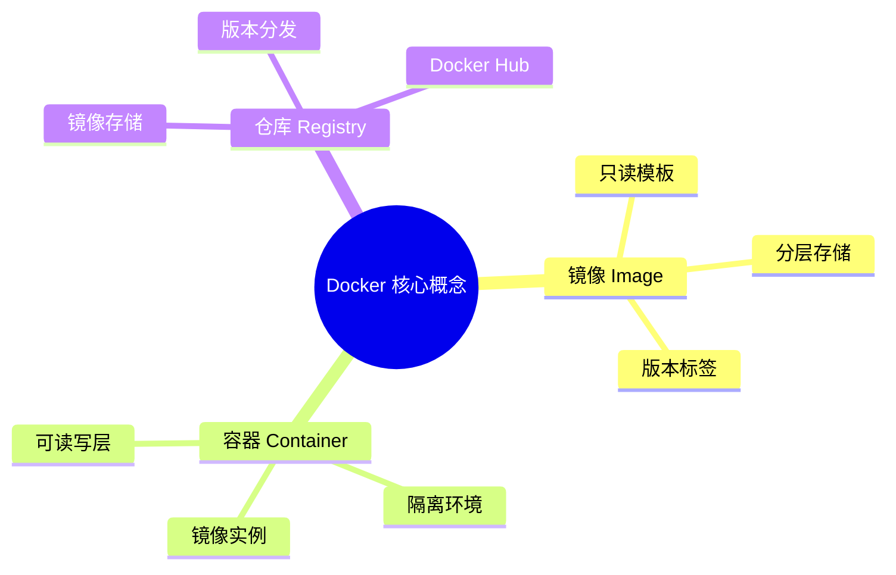

### 2.2 镜像（Image）—— 应用的蓝图

**镜像**是一个只读模板，包含运行应用所需的所有内容：

- **源代码**：你的应用程序代码
- **运行时**：Node.js、Python、Java 等运行环境
- **系统工具**：curl、wget 等工具
- **库和依赖**：应用依赖的所有包
- **配置文件**：环境变量、启动参数等

**镜像的特点**：

1. **只读性**：镜像一旦创建就不能修改，确保一致性
2. **分层存储**：每层只存储变更，节省空间，加速传输
3. **版本标签**：通过标签管理不同版本（如 `nginx:1.21`, `nginx:alpine`）

```bash
# 拉取镜像
docker pull nginx:alpine

# 查看本地镜像
docker images

# 查看镜像分层
docker history nginx:alpine
```

### 2.3 容器（Container）—— 运行中的实例

**容器**是镜像的运行实例，可以理解为：

```
容器 = 镜像 + 运行状态 + 可写层
```

**容器的特点**：

1. **隔离执行**：每个容器有独立的进程空间、网络、文件系统
2. **可读写层**：容器运行时的修改存储在最上层
3. **短暂性**：容器可以随时创建、启动、停止、删除
4. **端口映射**：可以将容器端口映射到主机

```bash
# 运行容器
docker run -d -p 8080:80 --name my-nginx nginx:alpine

# 查看运行中的容器
docker ps

# 进入容器
docker exec -it my-nginx sh

# 查看容器日志
docker logs my-nginx
```

### 2.4 仓库（Registry）—— 镜像的存储库

**仓库**是存储和分发 Docker 镜像的服务：

- **Docker Hub**：官方公共仓库，数百万免费镜像
- **私有仓库**：企业内部搭建，管理敏感镜像
- **云厂商仓库**：AWS ECR、阿里云 ACR 等

```bash
# 从 Docker Hub 拉取镜像
docker pull nginx:latest

# 推送镜像到仓库
docker tag myapp:v1 username/myapp:v1
docker push username/myapp:v1

# 从私有仓库拉取
docker pull registry.example.com/myapp:v1
```

### 2.5 概念关系流程图

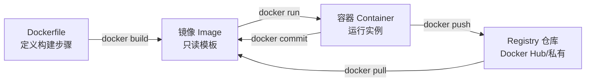

**工作流程说明**：

1. **编写 Dockerfile**：定义如何构建镜像
2. **构建镜像**：`docker build` 根据 Dockerfile 创建镜像
3. **运行容器**：`docker run` 从镜像启动容器
4. **推送仓库**：`docker push` 将镜像上传到仓库
5. **拉取镜像**：`docker pull` 从仓库下载镜像

### 2.6 镜像分层结构详解

Docker 镜像采用分层存储机制，每一层都是只读的：

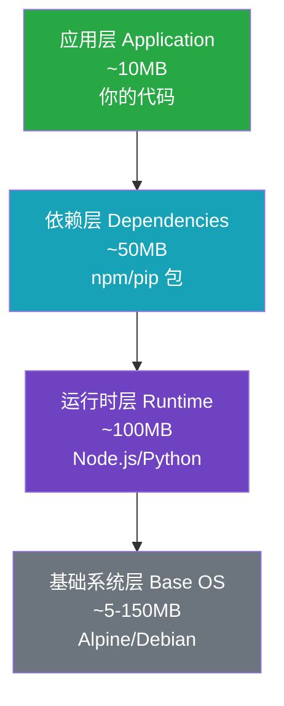

**分层存储的优势**：

- **节省空间**：相同基础层只存储一份
- **加速传输**：只传输变化的层
- **缓存复用**：构建时复用已缓存的层

**写时复制（Copy-on-Write）机制**：

当容器启动时，Docker 会在镜像层之上添加一个可写层。容器对文件的修改：

1. 如果文件在镜像层，先复制到可写层再修改
2. 新创建的文件直接写入可写层
3. 删除文件时，只是在可写层标记为删除

```bash
# 查看镜像分层
docker image inspect nginx:alpine --format='{{json .RootFS.Layers}}'

# 查看容器层的变化
docker diff container_id
```

---

## 3. Docker 架构深度解析

理解 Docker 的内部架构有助于更好地使用和问题排查。

### 3.1 Docker 架构全景图

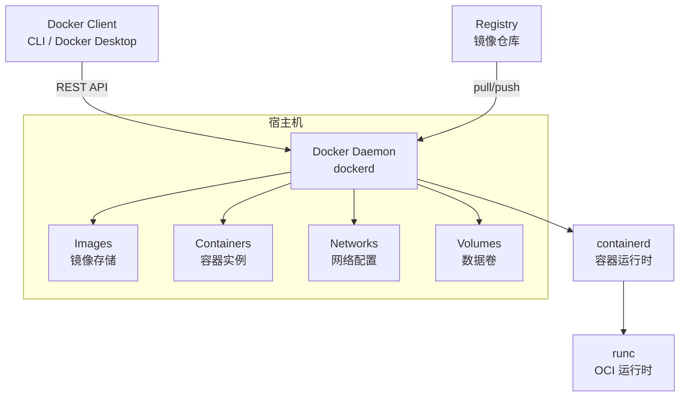

### 3.2 核心组件详解

| 组件 | 职责 | 说明 |
|------|------|------|
| **Docker Client** | 用户接口 | CLI 命令、Docker Desktop GUI |
| **Docker Daemon** | 核心服务 | 监听 API，管理所有容器对象 |
| **containerd** | 容器管理 | 管理容器生命周期 |
| **runc** | 底层运行时 | 按 OCI 规范创建容器进程 |
| **Registry** | 镜像存储 | Docker Hub 或私有仓库 |

### 3.3 `docker run` 命令的完整执行流程

当你执行 `docker run -d nginx:alpine` 时，背后发生了以下步骤：

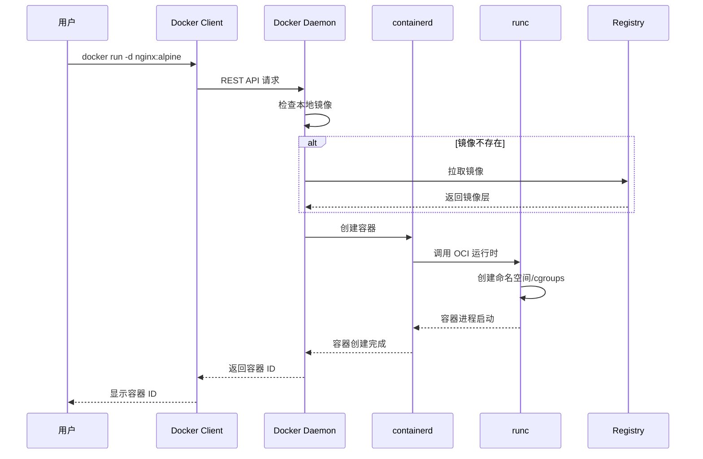

**详细步骤说明**：

1. **用户执行命令**：`docker run -d nginx:alpine`
2. **Client 发送请求**：通过 REST API 与 Daemon 通信
3. **Daemon 检查镜像**：本地是否存在，不存在则从 Registry 拉取
4. **调用 containerd**：准备容器配置和 rootfs（根文件系统）
5. **containerd 调用 runc**：使用 OCI 规范创建容器
6. **runc 创建容器**：设置命名空间、cgroups、挂载点等
7. **容器启动**：执行指定命令，返回容器 ID

### 3.4 组件交互关系

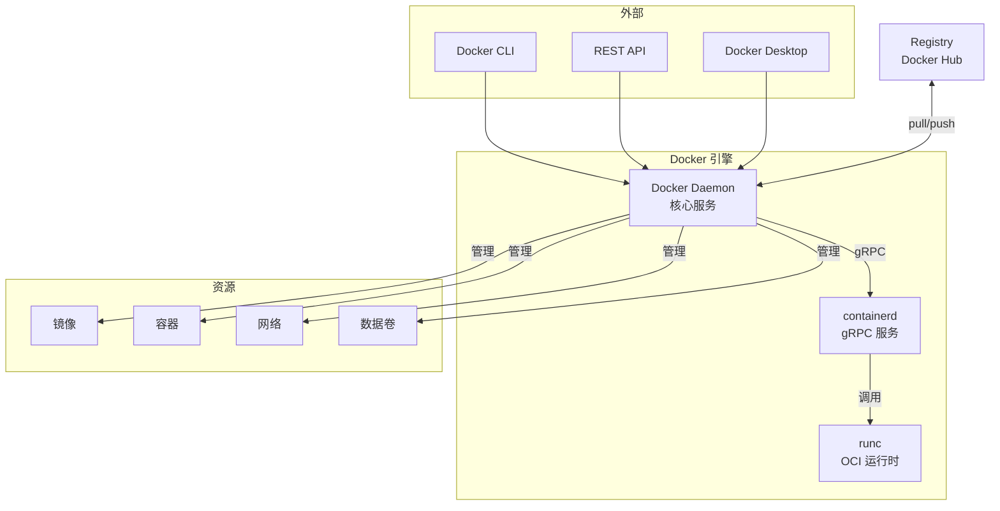

---

## 4. Dockerfile 完全指南

Dockerfile 是定义镜像构建过程的文本文件，掌握 Dockerfile 是创建高效镜像的关键。

### 4.1 Dockerfile 基础示例

```dockerfile
# Node.js 应用示例
FROM node:20-alpine

WORKDIR /app

COPY package*.json ./
RUN npm ci --only=production

COPY . .

EXPOSE 3000

CMD ["node", "server.js"]
```

### 4.2 多阶段构建（Multi-stage Builds）

多阶段构建是减小镜像大小的利器，它允许：

- 在一个 Dockerfile 中使用多个 FROM 语句
- 每个 FROM 开始一个新的构建阶段
- 可以从前面的阶段复制文件到当前阶段
- 最终镜像只包含最后一个阶段的内容

```dockerfile
# 构建阶段
FROM node:20-alpine AS builder
WORKDIR /app
COPY . .
RUN npm ci && npm run build

# 生产阶段
FROM node:20-alpine
WORKDIR /app
COPY --from=builder /app/dist ./dist
COPY --from=builder /app/node_modules ./node_modules
EXPOSE 3000
CMD ["node", "dist/server.js"]
```

**多阶段构建的优势**：

| 指标 | 单阶段构建 | 多阶段构建 |
|------|-----------|-----------|
| 镜像大小 | ~500MB | ~170MB |
| 构建工具 | 包含在镜像中 | 不包含 |
| 源代码 | 包含在镜像中 | 只包含编译结果 |
| 安全性 | 较低 | 更高 |

### 4.3 完整指令列表

| 指令 | 说明 | 示例 |
|------|------|------|
| `FROM` | 指定基础镜像（必须） | `FROM node:20-alpine` |
| `WORKDIR` | 设置工作目录 | `WORKDIR /app` |
| `COPY` | 复制文件到镜像 | `COPY package*.json ./` |
| `ADD` | 复制文件（支持 URL/解压） | `ADD app.tar.gz /app` |
| `RUN` | 执行命令并提交 | `RUN npm install` |
| `CMD` | 容器启动默认命令 | `CMD ["node", "app.js"]` |
| `ENTRYPOINT` | 配置为可执行程序 | `ENTRYPOINT ["node"]` |
| `ENV` | 设置环境变量 | `ENV NODE_ENV=production` |
| `ARG` | 构建时变量 | `ARG VERSION=1.0` |
| `EXPOSE` | 声明端口 | `EXPOSE 3000` |
| `VOLUME` | 创建挂载点 | `VOLUME /data` |
| `USER` | 指定运行用户 | `USER node` |
| `HEALTHCHECK` | 健康检查 | `HEALTHCHECK CMD curl -f http://localhost/` |
| `LABEL` | 添加元数据 | `LABEL version="1.0"` |

### 4.4 CMD vs ENTRYPOINT 详解

这是最容易混淆的两个指令：

| 特性 | CMD | ENTRYPOINT |
|------|-----|------------|
| 目的 | 设置默认命令和参数 | 配置容器为可执行程序 |
| 覆盖方式 | `docker run` 时直接替换 | 需要 `--entrypoint` 参数 |
| 组合使用 | 作为 ENTRYPOINT 的默认参数 | 定义主命令 |

**组合使用示例**：

```dockerfile
ENTRYPOINT ["node"]
CMD ["app.js"]

# 执行效果：
# docker run myapp        → node app.js
# docker run myapp server.js → node server.js
```

### 4.5 常见错误与最佳实践

#### ❌ 错误 1：使用 latest 标签

```dockerfile
# 不推荐
FROM node:latest
```

**问题**：latest 标签会变化，导致构建不可重复

```dockerfile
# 推荐
FROM node:20-alpine3.19
```

#### ❌ 错误 2：忽略缓存顺序

```dockerfile
# 不推荐
COPY . .
RUN npm install  # 任何文件变化都会重新执行
```

```dockerfile
# 推荐
COPY package*.json ./
RUN npm install  # 只有依赖文件变化才重新执行
COPY . .
```

#### ❌ 错误 3：以 root 运行

```dockerfile
# 不推荐
FROM node:20-alpine
CMD ["node", "app.js"]  # 默认 root 用户
```

```dockerfile
# 推荐
FROM node:20-alpine
RUN addgroup -g 1001 app && adduser -u 1001 -G app user
USER user
CMD ["node", "app.js"]
```

#### ❌ 错误 4：镜像过大

```dockerfile
# 不推荐
FROM node:20  # Debian 基础镜像 ~900MB
```

```dockerfile
# 推荐
FROM node:20-alpine  # Alpine ~170MB
```

#### ❌ 错误 5：多层 RUN 指令

```dockerfile
# 不推荐
RUN apk add --no-cache git
RUN apk add --no-cache curl
RUN apk add --no-cache vim
```

```dockerfile
# 推荐
RUN apk add --no-cache git curl vim
```

#### ❌ 错误 6：复制无用文件

```dockerfile
# 不推荐
COPY . .  # 复制所有文件
```

```dockerfile
# 推荐
# 使用 .dockerignore
# node_modules
# .git
# *.md
# .env
COPY . .
```

### 4.6 最佳实践完整清单

```dockerfile
# 1. 使用特定版本的基础镜像
FROM node:20-alpine3.19

# 2. 设置工作目录
WORKDIR /app

# 3. 先复制依赖文件，利用缓存
COPY package*.json ./
RUN npm ci --only=production

# 4. 再复制源代码
COPY . .

# 5. 创建非 root 用户
RUN addgroup -g 1001 -S appgroup && adduser -S appuser -u 1001 -G appgroup

# 6. 设置环境变量
ENV NODE_ENV=production

# 7. 声明端口
EXPOSE 3000

# 8. 切换用户
USER appuser

# 9. 健康检查
HEALTHCHECK --interval=30s --timeout=3s \
  CMD wget -q --spider http://localhost:3000/health || exit 1

# 10. 设置启动命令
CMD ["node", "server.js"]
```

---

## 5. Docker Compose 多容器编排

Docker Compose 是定义和运行多容器应用的工具，使用 YAML 文件配置服务、网络和数据卷。

### 5.1 为什么需要 Docker Compose？

现代应用通常由多个服务组成：

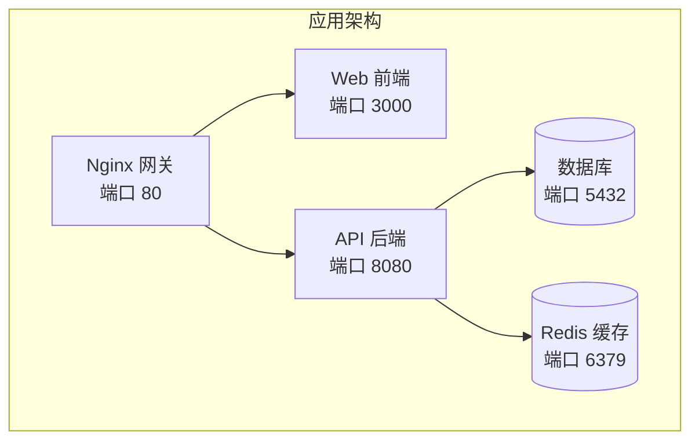

手动管理这些容器非常繁琐：

```bash
# 手动启动 5 个容器
docker run -d --name db -e POSTGRES_PASSWORD=secret postgres
docker run -d --name redis redis
docker run -d --name api --link db --link redis myapi
docker run -d --name web --link api nginx
# ... 还需要配置网络、卷等
```

使用 Docker Compose，只需一个命令：

```bash
docker compose up -d
```

### 5.2 docker-compose.yml 基本结构

```yaml
version: "3.8"  # 可选，新版本已不需要

services:       # 定义服务
  webapp:
    image: nginx:alpine
    ports:
      - "80:80"
    volumes:
      - ./html:/usr/share/nginx/html
    networks:
      - frontend

networks:       # 定义网络（可选）
  frontend:
    driver: bridge

volumes:        # 定义数据卷（可选）
  db-data:

configs:        # 定义配置（可选）
  my-config:
    file: ./config.txt

secrets:        # 定义机密（可选）
  db-password:
    file: ./secrets/password.txt
```

### 5.3 完整示例：Web 应用 + 数据库 + Redis

```yaml
services:
  web:
    build:
      context: .
      dockerfile: Dockerfile
      args:
        - NODE_ENV=production
    ports:
      - "3000:3000"
    environment:
      - NODE_ENV=production
      - DATABASE_URL=postgres://user:pass@db:5432/myapp
      - REDIS_URL=redis://redis:6379
    depends_on:
      db:
        condition: service_healthy
      redis:
        condition: service_started
    networks:
      - frontend
      - backend
    volumes:
      - ./logs:/app/logs
    restart: unless-stopped
    healthcheck:
      test: ["CMD", "wget", "-q", "--spider", "http://localhost:3000/health"]
      interval: 30s
      timeout: 10s
      retries: 3
    deploy:
      resources:
        limits:
          cpus: '1'
          memory: 512M

  db:
    image: postgres:16-alpine
    environment:
      POSTGRES_DB: myapp
      POSTGRES_USER: user
      POSTGRES_PASSWORD: password
    volumes:
      - db-data:/var/lib/postgresql/data
    networks:
      - backend
    healthcheck:
      test: ["CMD-SHELL", "pg_isready -U user -d myapp"]
      interval: 10s
      timeout: 5s
      retries: 5
    restart: unless-stopped

  redis:
    image: redis:7-alpine
    command: redis-server --appendonly yes
    volumes:
      - redis-data:/data
    networks:
      - backend
    restart: unless-stopped

networks:
  frontend:
    driver: bridge
  backend:
    driver: bridge
    internal: true  # 内部网络，外部无法访问

volumes:
  db-data:
  redis-data:
```

### 5.4 服务启动依赖关系


### 5.5 常用命令速查

```bash
# ===== 服务管理 =====
docker compose up -d              # 后台启动所有服务
docker compose up -d --build      # 重建镜像后启动
docker compose up -d web db       # 只启动指定服务
docker compose down               # 停止并删除容器、网络
docker compose down -v            # 同时删除数据卷
docker compose down --rmi all     # 同时删除镜像

# ===== 查看状态 =====
docker compose ps                 # 查看服务状态
docker compose logs               # 查看所有日志
docker compose logs -f web        # 实时查看 web 服务日志
docker compose top                # 查看进程

# ===== 服务操作 =====
docker compose start web          # 启动服务
docker compose stop web           # 停止服务
docker compose restart web        # 重启服务
docker compose pause web          # 暂停服务
docker compose unpause web        # 恢复服务

# ===== 执行命令 =====
docker compose exec web sh        # 进入容器
docker compose exec db psql -U user myapp  # 在 db 容器执行命令
docker compose run --rm web npm test       # 一次性运行命令

# ===== 其他 =====
docker compose config             # 验证配置文件
docker compose pull               # 拉取所有镜像
docker compose push               # 推送所有镜像
```

### 5.6 常见应用场景

#### 场景 1：开发环境（热重载）

```yaml
services:
  app:
    build: .
    ports:
      - "3000:3000"
    volumes:
      - .:/app           # 挂载代码目录，支持热重载
      - /app/node_modules  # 防止本地 node_modules 覆盖
    environment:
      - NODE_ENV=development
      - CHOKIDAR_USEPOLLING=true  # 支持文件监听
    command: npm run dev

  db:
    image: postgres:16-alpine
    ports:
      - "5432:5432"     # 暴露端口便于本地连接
    environment:
      POSTGRES_DB: dev
      POSTGRES_USER: dev
      POSTGRES_PASSWORD: dev
    volumes:
      - dev-data:/var/lib/postgresql/data

volumes:
  dev-data:
```

#### 场景 2：微服务架构

```yaml
services:
  gateway:
    image: nginx:alpine
    ports:
      - "80:80"
    volumes:
      - ./nginx.conf:/etc/nginx/nginx.conf:ro
    depends_on:
      - api
      - web
    networks:
      - frontend

  api:
    build: ./api
    environment:
      - DATABASE_URL=postgres://db:5432/myapp
    depends_on:
      - db
      - redis
    networks:
      - frontend
      - backend

  web:
    build: ./web
    networks:
      - frontend

  db:
    image: postgres:16-alpine
    volumes:
      - db-data:/var/lib/postgresql/data
    networks:
      - backend

  redis:
    image: redis:7-alpine
    networks:
      - backend

networks:
  frontend:
  backend:
    internal: true  # 只有内部服务可访问
```

#### 场景 3：CI/CD 测试

```yaml
services:
  app:
    build: .
    depends_on:
      db:
        condition: service_healthy
    environment:
      - DATABASE_URL=postgres://test:test@db:5432/test
    command: npm test

  db:
    image: postgres:16-alpine
    environment:
      POSTGRES_DB: test
      POSTGRES_USER: test
      POSTGRES_PASSWORD: test
    healthcheck:
      test: ["CMD-SHELL", "pg_isready -U test"]
      interval: 5s
      timeout: 5s
      retries: 10
    tmpfs:
      - /var/lib/postgresql/data  # 使用内存存储，测试更快
```

#### 场景 4：多环境配置

```yaml
# docker-compose.yml（基础配置）
services:
  web:
    image: myapp
    ports:
      - "3000:3000"

# docker-compose.override.yml（开发环境，自动加载）
services:
  web:
    build: .
    volumes:
      - .:/app
    environment:
      - DEBUG=true

# docker-compose.prod.yml（生产环境）
services:
  web:
    image: myapp:latest
    restart: always
    deploy:
      replicas: 3

# 使用方式：
# 开发环境：docker compose up
# 生产环境：docker compose -f docker-compose.yml -f docker-compose.prod.yml up -d
```

### 5.7 常见错误与解决方案

#### ❌ 错误 1：端口冲突

```yaml
# 问题
ports:
  - "80:80"  # 本地 80 端口已被占用

# 解决
ports:
  - "8080:80"  # 使用其他本地端口
```

#### ❌ 错误 2：服务启动顺序

```yaml
# 问题
depends_on:
  - db  # 只等待容器启动，不等待服务就绪

# 解决
depends_on:
  db:
    condition: service_healthy  # 等待健康检查通过
```

#### ❌ 错误 3：数据丢失

```bash
# 危险操作
docker compose down -v  # 删除所有数据卷

# 生产环境建议定期备份
docker compose exec db pg_dump -U user myapp > backup.sql
```

#### ❌ 错误 4：环境变量未传递

```yaml
# 问题
environment:
  - DB_PASS=$DB_PASSWORD  # 变量未定义时为空

# 解决
# 使用 .env 文件
# .env
DB_PASSWORD=secret

# 或设置默认值
environment:
  - DB_PASS=${DB_PASSWORD:-default}
```

### 5.8 服务配置指令详解

| 指令 | 说明 | 示例 |
|------|------|------|
| `image` | 指定镜像名称 | `image: nginx:alpine` |
| `build` | 构建配置 | `build: ./dir` |
| `ports` | 端口映射 | `["3000:3000"]` |
| `expose` | 暴露端口（仅内部） | `["3000"]` |
| `environment` | 环境变量 | `KEY=value` |
| `env_file` | 从文件加载环境变量 | `env_file: .env` |
| `volumes` | 挂载卷 | `["./data:/app/data"]` |
| `networks` | 连接的网络 | `["frontend", "backend"]` |
| `depends_on` | 服务依赖 | `["db", "redis"]` |
| `restart` | 重启策略 | `always / unless-stopped` |
| `command` | 覆盖默认命令 | `["node", "server.js"]` |
| `entrypoint` | 覆盖入口点 | `["/app/entrypoint.sh"]` |
| `healthcheck` | 健康检查 | test, interval, timeout, retries |
| `deploy` | 部署配置 | replicas, resources |

---

## 6. Docker 网络深入理解

Docker 提供多种网络模式，满足不同应用场景的需求。

### 6.1 Docker 网络类型

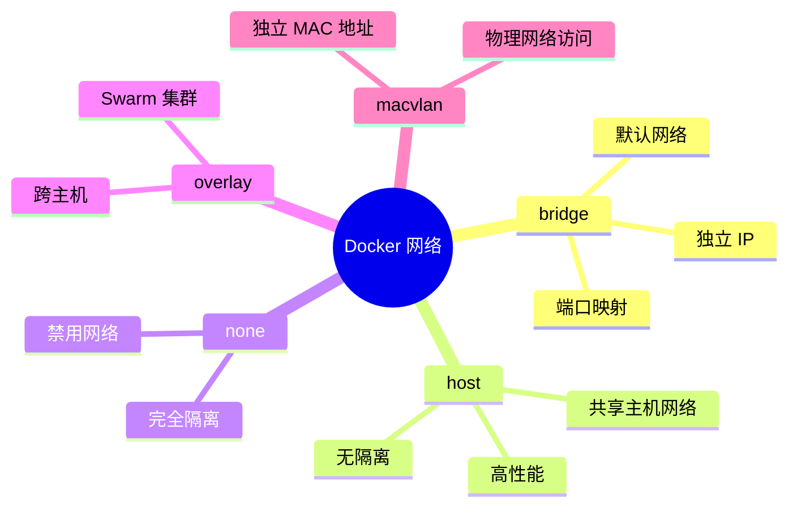

### 6.2 网络类型对比

| 类型 | 说明 | 应用场景 |
|------|------|----------|
| **bridge** | 默认网络，容器间可通过 IP 通信 | 单机多容器应用 |
| **host** | 容器共享主机网络，无网络隔离 | 高性能网络应用、监控 |
| **none** | 禁用网络 | 安全隔离、离线任务 |
| **overlay** | 跨主机网络（需 Swarm） | 分布式集群应用 |
| **macvlan** | 容器拥有独立 MAC 地址 | 需要物理网络直接访问 |

### 6.3 网络架构示意图

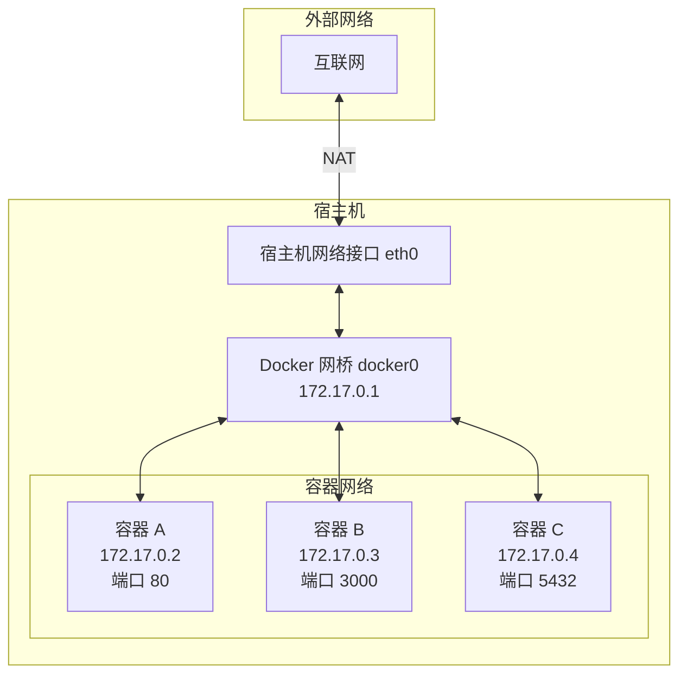

### 6.4 容器与外界通讯过程

#### 1. 容器访问外部网络

```bash
# 容器访问互联网的过程：
# 1. 容器发送请求（源 IP: 172.17.0.2）
# 2. 请求经过 docker0 网桥
# 3. 通过 NAT（网络地址转换）转换为宿主机 IP
# 4. 请求发送到外部网络
# 5. 响应按原路返回

# 示例：容器内访问外部 API
docker run --rm alpine wget -qO- https://api.github.com

# 查看容器的网络配置
docker run --rm alpine ip addr show
```

#### 2. 外部访问容器（端口映射）

```bash
# 端口映射原理：
# 外部请求 → 宿主机端口 → iptables 转发 → 容器端口

# 映射单个端口
docker run -d -p 8080:80 nginx
# 宿主机 8080 → 容器 80

# 映射多个端口
docker run -d -p 8080:80 -p 8443:443 nginx

# 指定 IP 绑定
docker run -d -p 127.0.0.1:8080:80 nginx
# 只允许本地访问

# 映射 UDP 端口
docker run -d -p 53:53/udp dns-server

# 查看端口映射
docker port container_name
```

#### 3. 容器间通讯

```bash
# 同一 bridge 网络内的容器通讯：

# 方式 1：通过 IP 地址
# 容器 A (172.17.0.2) → 容器 B (172.17.0.3)
curl http://172.17.0.3:3000

# 方式 2：通过容器名称（需要自定义网络）
docker network create mynet
docker run -d --name db --network mynet postgres
docker run -d --name app --network mynet myapp

# app 容器可以通过名称访问 db
# postgresql://db:5432/mydb
```

### 6.5 网络模式对比表

| 网络模式 | 容器 IP | 访问外部 | 外部访问容器 | 容器间通讯 |
|----------|---------|----------|--------------|------------|
| **bridge** | 独立 IP（如 172.17.0.x） | ✅ 通过 NAT | ✅ 需要端口映射 | ✅ 通过 IP 或名称 |
| **host** | 共享宿主机 IP | ✅ 直接访问 | ✅ 直接访问容器端口 | ✅ 通过 localhost |
| **none** | 无 | ❌ 无法访问 | ❌ 无法访问 | ❌ 无法通讯 |
| **macvlan** | 物理网络 IP | ✅ 直接访问 | ✅ 直接访问 | ✅ 通过物理网络 |

### 6.6 完整网络示例

```bash
# 场景：Web 应用 + 数据库 + Redis

# 1. 创建网络
docker network create app-network

# 2. 启动数据库（内部端口，不映射到外部）
docker run -d \
  --name db \
  --network app-network \
  -e POSTGRES_PASSWORD=secret \
  postgres:16-alpine
# 数据库只能在网络内部访问

# 3. 启动 Redis（内部端口）
docker run -d \
  --name redis \
  --network app-network \
  redis:7-alpine

# 4. 启动 Web 应用（映射端口到外部）
docker run -d \
  --name web \
  --network app-network \
  -p 3000:3000 \
  -e DATABASE_URL=postgres://postgres:secret@db:5432 \
  -e REDIS_URL=redis://redis:6379 \
  myapp

# 通讯路径：
# 外部用户 → 宿主机:3000 → web 容器:3000
# web 容器 → db:5432（内部 DNS 解析）
# web 容器 → redis:6379（内部 DNS 解析）

# 验证通讯
docker exec -it web ping db      # Web → DB
docker exec -it web ping redis    # Web → Redis
curl http://localhost:3000        # 外部 → Web
```

### 6.7 常用网络命令

```bash
# 查看网络列表
docker network ls

# 创建自定义网络
docker network create mynet

# 创建指定类型的网络
docker network create -d bridge mynet
docker network create -d host myhost

# 查看网络详情
docker network inspect mynet

# 连接容器到网络
docker network connect mynet container_name

# 断开容器网络
docker network disconnect mynet container_name

# 删除网络
docker network rm mynet
```

### 6.8 常见网络问题排查

```bash
# 问题 1：容器无法访问外部网络
# 检查 DNS
docker run --rm alpine nslookup google.com
docker run --rm alpine ping -c 3 8.8.8.8

# 问题 2：外部无法访问容器端口
# 检查端口映射
docker port container_name
# 检查防火墙
sudo ufw status
sudo iptables -L -n | grep 8080

# 问题 3：容器间无法通讯
# 确认在同一网络
docker network inspect mynet
# 检查容器网络配置
docker exec container_name ip addr show

# 问题 4：DNS 解析失败
# 使用自定义 DNS
docker run --dns 8.8.8.8 myapp

# 问题 5：端口冲突
# 查看端口占用
lsof -i :8080
netstat -tlnp | grep 8080
```

---

## 7. 数据卷与持久化存储

数据卷用于持久化容器数据，独立于容器生命周期。

### 7.1 三种存储类型对比

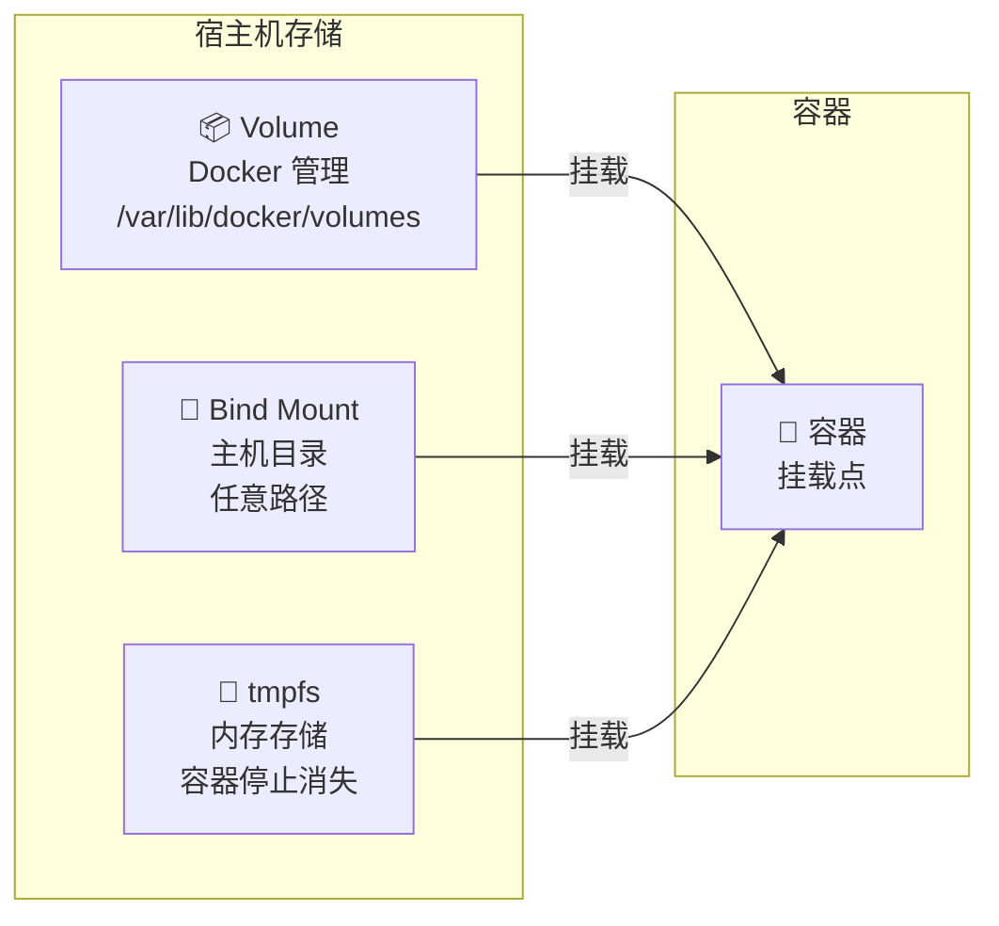

### 7.2 存储类型详细对比

| 类型 | 说明 | 应用场景 |
|------|------|----------|
| **Volume** | Docker 管理的存储，存储在 `/var/lib/docker/volumes` | 数据库、持久化数据、多容器共享 |
| **Bind Mount** | 绑定主机目录到容器 | 开发环境、配置文件挂载 |
| **tmpfs** | 存储在内存中，容器停止即消失 | 敏感数据、临时缓存 |

### 7.3 Volume vs Bind Mount

| 特性 | Volume | Bind Mount |
|------|--------|------------|
| 管理方式 | Docker 管理 | 用户管理 |
| 存储位置 | `/var/lib/docker/volumes/` | 主机任意目录 |
| 跨平台 | ✅ 兼容 | ❌ 依赖主机路径 |
| 备份迁移 | ✅ 易于备份 | ❌ 需要手动处理 |
| 多容器共享 | ✅ 支持 | ✅ 支持 |
| 开发热重载 | ❌ 不适合 | ✅ 完美支持 |
| 性能 | 好 | 最好 |

### 7.4 数据流向示意

```mermaid
flowchart LR
    A[写入数据<br/>/app/data] -->|容器内路径 | B[Volume<br/>mydata]
    B -->|Docker 管理 | C[/var/lib/docker<br/>/volumes/mydata]
    C -->|宿主机存储 | D[持久化存储]
    
    style A fill:#17a2b8,color:#fff
    style B fill:#28a745,color:#fff
    style C fill:#6f42c1,color:#fff
    style D fill:#6c757d,color:#fff
```

### 7.5 常用命令

```bash
# 创建数据卷
docker volume create mydata

# 列出所有数据卷
docker volume ls

# 查看数据卷详情
docker volume inspect mydata

# 删除数据卷
docker volume rm mydata

# 清理未使用的数据卷
docker volume prune
```

### 7.6 应用场景示例

#### 场景 1：数据库持久化

```bash
# PostgreSQL 数据持久化
docker run -d \
  --name postgres \
  -v pgdata:/var/lib/postgresql/data \
  -e POSTGRES_PASSWORD=secret \
  postgres:16-alpine

# 即使容器删除，数据仍然保留
docker rm -f postgres
docker run -d \
  --name postgres \
  -v pgdata:/var/lib/postgresql/data \
  postgres:16-alpine
# 数据恢复
```

#### 场景 2：开发环境热重载

```bash
# 挂载本地代码目录，修改立即生效
docker run -d \
  --name dev-app \
  -v $(pwd)/src:/app/src \
  -v $(pwd)/package.json:/app/package.json \
  -p 3000:3000 \
  node:20-alpine \
  npm run dev

# 本地修改代码，容器内自动更新
```

#### 场景 3：配置文件管理

```bash
# 挂载配置文件
docker run -d \
  --name nginx \
  -v $(pwd)/nginx.conf:/etc/nginx/nginx.conf:ro \
  -v $(pwd)/html:/usr/share/nginx/html:ro \
  -p 80:80 \
  nginx:alpine

# :ro 表示只读挂载，防止容器修改配置
```

#### 场景 4：多容器共享数据

```bash
# 创建共享数据卷
docker volume create shared-data

# 写入容器
docker run -d --name writer \
  -v shared-data:/data \
  alpine sh -c "echo 'hello' > /data/file.txt"

# 读取容器
docker run --name reader \
  -v shared-data:/data \
  alpine cat /data/file.txt
# 输出：hello
```

#### 场景 5：敏感数据（tmpfs）

```bash
# 使用内存存储敏感数据
docker run -d \
  --name app \
  --tmpfs /run/secrets:rw,size=10m,mode=1777 \
  myapp

# 数据不会写入磁盘，容器停止即消失
```

### 7.7 存储类型选择指南

| 需求 | 推荐类型 | 原因 |
|------|----------|------|
| 数据库持久化 | Volume | Docker 管理，易于备份迁移 |
| 开发时代码同步 | Bind Mount | 实时同步，IDE 直接编辑 |
| 配置文件 | Bind Mount (:ro) | 版本控制，只读防误改 |
| 敏感数据 | tmpfs | 内存存储，不留痕迹 |
| 多容器共享 | Volume | 独立于容器，可共享 |
| 临时缓存 | tmpfs | 高速访问，自动清理 |

---

## 8. 企业级私有仓库搭建

Docker Registry 是存储和分发 Docker 镜像的服务，企业可自建私有 Registry 来管理内部镜像。

### 8.1 为什么需要私有 Registry？

| 优势 | 说明 |
|------|------|
| **安全合规** | 敏感镜像不上传公网，数据完全自主可控 |
| **访问速度** | 内网拉取镜像更快，不占用公网带宽 |
| **成本控制** | 避免 Docker Hub 拉取次数限制和付费 |
| **版本管理** | 统一管理内部应用的镜像版本 |

### 8.2 快速搭建 Registry

```bash
# 1. 最简单的启动方式
docker run -d \
  --name registry \
  -p 5000:5000 \
  -v registry-data:/var/lib/registry \
  --restart always \
  registry:2

# 2. 使用 Docker Compose（推荐）
# docker-compose.yml
services:
  registry:
    image: registry:2
    ports:
      - "5000:5000"
    environment:
      REGISTRY_STORAGE_FILESYSTEM_ROOTDIRECTORY: /var/lib/registry
    volumes:
      - registry-data:/var/lib/registry
    restart: always

volumes:
  registry-data:
```

### 8.3 推送和拉取镜像

```bash
# 1. 标记镜像指向私有仓库
docker tag myapp:v1 localhost:5000/myapp:v1

# 2. 推送镜像
docker push localhost:5000/myapp:v1

# 3. 拉取镜像
docker pull localhost:5000/myapp:v1

# 4. 查看仓库中的镜像
curl http://localhost:5000/v2/_catalog
curl http://localhost:5000/v2/myapp/tags/list
```

### 8.4 配置 HTTPS（生产必需）

```yaml
# 使用 Nginx 反向代理 + Let's Encrypt

# docker-compose.yml
services:
  registry:
    image: registry:2
    volumes:
      - registry-data:/var/lib/registry
    restart: always

  nginx:
    image: nginx:alpine
    ports:
      - "443:443"
    volumes:
      - ./nginx.conf:/etc/nginx/nginx.conf:ro
      - ./certs:/etc/nginx/certs:ro
    depends_on:
      - registry

volumes:
  registry-data:
```

### 8.5 配置认证

```bash
# 1. 创建用户密码文件
docker run --rm \
  --entrypoint htpasswd \
  httpd:2 -Bbn admin password123 > htpasswd

# 2. 启动带认证的 Registry
docker run -d \
  --name registry \
  -p 5000:5000 \
  -v registry-data:/var/lib/registry \
  -v $(pwd)/htpasswd:/etc/docker/registry/htpasswd \
  -e REGISTRY_AUTH=htpasswd \
  -e REGISTRY_AUTH_HTPASSWD_REALM="Registry Realm" \
  -e REGISTRY_AUTH_HTPASSWD_PATH=/etc/docker/registry/htpasswd \
  registry:2

# 3. 登录私有仓库
docker login localhost:5000

# 4. 推送镜像（需要先登录）
docker push localhost:5000/myapp:v1
```

### 8.6 Registry 方案对比

| 方案 | 复杂度 | 功能 | 适用场景 |
|------|--------|------|----------|
| **Docker Registry** | ⭐ 简单 | 基础存储分发 | 小型团队、测试环境 |
| **Registry + Nginx** | ⭐⭐ 中等 | HTTPS、认证 | 中型团队、生产环境 |
| **Harbor** | ⭐⭐⭐ 复杂 | 全功能企业级 | 大型企业、合规要求 |
| **Nexus** | ⭐⭐⭐ 复杂 | 多格式仓库 | 统一制品管理 |

---

## 9. 安全最佳实践

容器安全是生产环境必须重视的问题。

### 9.1 核心安全实践

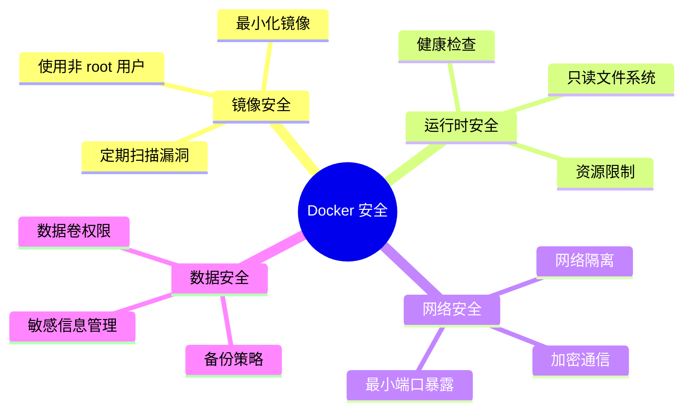

### 9.2 使用非 root 用户

```dockerfile
# 创建专用用户
RUN addgroup -g 1001 appgroup && \
    adduser -u 1001 -G appgroup appuser

# 切换到非 root 用户
USER appuser
```

### 9.3 最小化镜像

```dockerfile
# 使用 Alpine 基础镜像
FROM alpine:3.19

# 或使用 distroless（无 shell，更安全）
FROM gcr.io/distroless/static
```

### 9.4 健康检查

```dockerfile
HEALTHCHECK --interval=30s --timeout=3s --retries=3 \
  CMD wget -q --spider http://localhost:3000/health || exit 1
```

### 9.5 资源限制

```yaml
# docker-compose.yml
services:
  web:
    deploy:
      resources:
        limits:
          cpus: '0.5'
          memory: 256M
        reservations:
          cpus: '0.25'
          memory: 128M
```

### 9.6 网络隔离

```yaml
services:
  web:
    networks:
      - frontend
  api:
    networks:
      - frontend
      - backend
  db:
    networks:
      - backend  # 只能被 api 访问

networks:
  frontend:
  backend:
    internal: true  # 外部无法访问
```

---

## 10. Docker 生态工具全景图

Docker 生态系统拥有丰富的周边工具，覆盖管理、监控、安全、开发等多个领域。

### 10.1 安全扫描工具

#### Docker Scout

Docker 官方的安全分析工具：

```bash
# 快速查看镜像安全概况
docker scout quickview nginx:latest

# 详细漏洞扫描
docker scout cves myapp:latest

# 只显示高危漏洞
docker scout cves --severity HIGH,CRITICAL myapp:latest

# 生成软件物料清单（SBOM）
docker scout sbom --format spdx-json --output sbom.json myapp:latest

# 在 CI/CD 中自动阻断不安全镜像
docker scout cves --exit-code 1 --severity HIGH,CRITICAL myapp:latest
```

#### Trivy

全面的开源安全扫描器：

```bash
# 扫描镜像
trivy image nginx:latest

# 扫描本地文件系统
trivy fs .

# 只显示高危漏洞
trivy image --severity HIGH,CRITICAL myapp:latest

# 输出 JSON 格式
trivy image --format json --output report.json myapp:latest
```

### 10.2 可视化管理工具

#### Portainer

最流行的 Docker 管理界面：

```bash
# 快速启动
docker run -d \
  --name portainer \
  -p 9443:9443 \
  -v /var/run/docker.sock:/var/run/docker.sock \
  -v portainer-data:/data \
  --restart always \
  portainer/portainer-ce:latest

# 访问：https://localhost:9443
```

#### Lazydocker

终端交互式管理：

```bash
# 安装
brew install jesseduffield/lazydocker/lazydocker

# 启动
lazydocker

# 快捷键：
# - 上/下：选择项目
# - Enter：查看详情
# - x：停止/删除
# - l：查看日志
# - s：进入容器 Shell
```

### 10.3 开发辅助工具

#### Dive - 镜像分析工具

```bash
# 安装
brew install dive

# 分析镜像
dive nginx:alpine

# 输出信息：
# - 每层的文件变更
# - 可能的优化建议
# - 镜像效率评分
# - 重复文件检测
```

#### Hadolint - Dockerfile 语法检查

```bash
# 安装
brew install hadolint

# 检查 Dockerfile
hadolint Dockerfile

# 只显示错误（忽略警告）
hadolint --ignore DL3008 Dockerfile
```

### 10.4 自动化工具

#### Watchtower - 自动更新容器

```yaml
# docker-compose.yml
services:
  watchtower:
    image: containrrr/watchtower
    volumes:
      - /var/run/docker.sock:/var/run/docker.sock
    environment:
      - WATCHTOWER_POLL_INTERVAL=3600
      - WATCHTOWER_CLEANUP=true
    restart: always
```

### 10.5 监控与日志

#### Prometheus + Grafana

完整监控方案：

```yaml
services:
  prometheus:
    image: prom/prometheus:latest
    ports:
      - "9090:9090"
    volumes:
      - ./prometheus.yml:/etc/prometheus/prometheus.yml:ro

  grafana:
    image: grafana/grafana:latest
    ports:
      - "3000:3000"
    volumes:
      - grafana-data:/var/lib/grafana
    environment:
      - GF_SECURITY_ADMIN_PASSWORD=admin

  cadvisor:
    image: gcr.io/cadvisor/cadvisor:latest
    volumes:
      - /:/rootfs:ro
      - /var/run:/var/run:ro
      - /sys:/sys:ro
      - /var/lib/docker/:/var/lib/docker:ro
```

#### Dozzle - 轻量级日志查看

```bash
docker run -d \
  --name dozzle \
  -p 9999:8080 \
  -v /var/run/docker.sock:/var/run/docker.sock \
  amir20/dozzle:latest

# 访问：http://localhost:9999
```

### 10.6 完整工具清单

| 类别 | 工具 | 用途 |
|------|------|------|
| **可视化管理** | Portainer | Web 管理界面 |
| | Lazydocker | 终端 UI 管理 |
| | Dockge | Compose 项目管理 |
| **监控** | ctop | 容器资源监控 |
| | Prometheus + Grafana | 完整监控方案 |
| **日志** | Dozzle | 轻量级日志查看 |
| **开发** | Dive | 镜像层分析 |
| | Hadolint | Dockerfile 检查 |
| | DevContainer | 容器化开发环境 |
| **自动化** | Watchtower | 自动更新容器 |
| | Skaffold/Tilt | K8s 开发流程 |
| **网络** | Traefik | 反向代理/负载均衡 |
| **安全** | Docker Scout | 官方安全扫描 |
| | Trivy | 漏洞扫描 |
| | Docker Bench | 安全基准检查 |
| **AI 相关** | Ask Gordon | AI 助手 |
| | GenAI Stack | AI 应用开发栈 |

---

## 11. Docker 替代方案对比

虽然 Docker 是最流行的容器化平台，但市面上还有其他优秀的替代方案。

### 11.1 容器运行时替代品

#### Podman - 无守护进程的容器引擎

**核心特点**：

- 无守护进程（daemonless）
- 默认 rootless 运行（更安全）
- 支持 Kubernetes YAML
- 兼容 Docker CLI 命令

```bash
# 命令与 Docker 几乎相同
podman pull nginx:alpine
podman run -d -p 8080:80 nginx
podman ps
podman images

# 生成 Kubernetes YAML
podman generate kube mycontainer > pod.yaml
```

#### Podman vs Docker

| 特性 | Docker | Podman |
|------|--------|--------|
| 守护进程 | 需要 dockerd | 无守护进程 |
| Root 权限 | 默认需要 root | 默认 rootless |
| Docker 兼容 | - | CLI 完全兼容 |
| Kubernetes 集成 | 需要额外工具 | 原生支持 |
| 安全性 | 中等 | 更高（rootless） |

#### containerd - 工业级容器运行时

从 Docker 分离出来的容器运行时，专注于运行容器，被 Kubernetes 作为默认运行时。

```bash
# 使用 ctr 命令管理容器
ctr images pull docker.io/library/nginx:alpine
ctr run -d docker.io/library/nginx:alpine mynginx
ctr containers list
```

### 11.2 镜像构建工具

#### Kaniko - 无 Docker 构建镜像

可以在不需要 Docker 守护进程的情况下构建镜像，适合 CI/CD 环境。

#### Buildah - 无守护进程构建

Podman 的姐妹项目，专注于构建 OCI 镜像，无需 root 权限。

```bash
# 从 Dockerfile 构建
buildah build -t myapp:v1 .

# 交互式构建
container=$(buildah from alpine)
buildah run $container -- apk add nginx
buildah commit $container myapp:nginx
```

#### BuildKit - Docker 下一代构建器

Docker 的新一代构建引擎，性能更强，支持并行构建和更好的缓存。

```bash
# 启用 BuildKit
export DOCKER_BUILDKIT=1
docker build -t myapp:v1 .

# 多平台构建
docker buildx build --platform linux/amd64,linux/arm64 -t myapp:v1 .
```

### 11.3 容器编排平台

#### Kubernetes - 容器编排标准

容器编排的事实标准，适合大规模生产环境。

```bash
# 本地开发环境
minikube start
kind create cluster
k3d cluster create mycluster

# 示例部署
kubectl create deployment nginx --image=nginx
kubectl expose deployment nginx --port=80 --type=NodePort
```

#### Docker Swarm - Docker 原生编排

Docker 内置的编排功能，简单易用，适合中小规模集群。

```bash
# 初始化 Swarm
docker swarm init

# 部署服务
docker service create \
  --name web \
  --replicas 3 \
  --publish 80:80 \
  nginx:alpine

# 使用 Stack 部署
docker stack deploy -c docker-compose.yml myapp
```

### 11.4 替代品对比总结

| 类别 | 工具 | 主要优势 | 适用场景 |
|------|------|----------|----------|
| **容器运行时** | Podman | 无守护进程、rootless | 安全要求高的环境 |
| | containerd | 轻量、稳定 | Kubernetes 节点 |
| | CRI-O | K8s 原生 | Kubernetes 专用 |
| **镜像构建** | Kaniko | 无 Docker 构建 | CI/CD 流水线 |
| | Buildah | rootless 构建 | 安全构建环境 |
| | BuildKit | 高性能、多平台 | 现代 Docker 构建 |
| **容器编排** | Kubernetes | 行业标准、功能强大 | 大规模生产环境 |
| | Nomad | 简单灵活 | 混合工作负载 |
| | Docker Swarm | Docker 原生、易用 | 中小规模集群 |

### 11.5 如何选择？

**继续使用 Docker**：
- 个人开发和学习
- 中小团队项目
- 需要最广泛的社区支持
- 使用 Docker Desktop 的 macOS/Windows 用户

**考虑 Podman**：
- 需要更高的安全性
- Linux 服务器环境
- 想要 rootless 容器
- 企业级 Red Hat 环境

**考虑 Kubernetes**：
- 大规模微服务架构
- 需要自动扩缩容
- 多云/混合云部署
- 企业生产环境

---

## 12. 实战案例与最佳实践

### 12.1 CI/CD 容器化流程

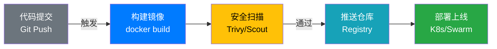

### 12.2 开发环境架构

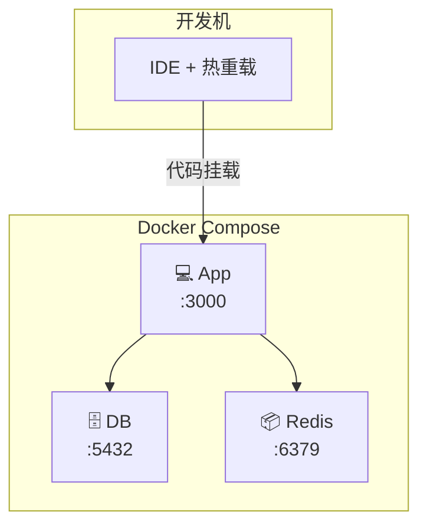

### 12.3 案例 1：Node.js Web 应用

```dockerfile
# Dockerfile
FROM node:20-alpine
WORKDIR /app
COPY package*.json ./
RUN npm ci --only=production
COPY . .
EXPOSE 3000
CMD ["node", "server.js"]
```

```yaml
# docker-compose.yml
services:
  app:
    build: .
    ports:
      - "3000:3000"
    volumes:
      - .:/app
    environment:
      - NODE_ENV=development
    command: npm run dev
```

### 12.4 案例 2：Python Flask 应用

```dockerfile
# Dockerfile
FROM python:3.12-slim
WORKDIR /app
COPY requirements.txt .
RUN pip install --no-cache-dir -r requirements.txt
COPY . .
EXPOSE 8000
CMD ["python", "app.py"]
```

### 12.5 案例 3：完整开发环境

```yaml
# docker-compose.yml
services:
  app:
    build: .
    ports:
      - "3000:3000"
    volumes:
      - .:/app
    environment:
      - DATABASE_URL=postgres://user:pass@db:5432/dev
      - REDIS_URL=redis://redis:6379
    depends_on:
      - db
      - redis

  db:
    image: postgres:16-alpine
    environment:
      POSTGRES_DB: dev
      POSTGRES_USER: user
      POSTGRES_PASSWORD: pass
    volumes:
      - db-data:/var/lib/postgresql/data
    ports:
      - "5432:5432"

  redis:
    image: redis:7-alpine
    ports:
      - "6379:6379"
    volumes:
      - redis-data:/data

volumes:
  db-data:
  redis-data:
```

### 12.6 学习路径建议


**推荐学习顺序**：

1. **基础入门**：安装 Docker、运行容器、理解核心概念
2. **镜像构建**：编写 Dockerfile、多阶段构建、最佳实践
3. **多容器应用**：Docker Compose、网络配置、数据卷
4. **进阶主题**：安全实践、监控日志、CI/CD 集成
5. **生产部署**：私有仓库、编排平台、性能优化

---

## 结语

Docker 作为容器化技术的代表，已经彻底改变了现代软件的开发、测试和部署方式。通过本文的详细介绍，相信你已经对 Docker 有了全面的认识。

**核心要点回顾**：

1. **容器化优势**：环境一致性、资源高效、快速部署
2. **核心概念**：镜像、容器、仓库三位一体
3. **Dockerfile**：掌握最佳实践，构建高效镜像
4. **Docker Compose**：简化多容器应用管理
5. **安全实践**：非 root 用户、最小化镜像、定期扫描
6. **生态工具**：丰富的工具链提升工作效率
7. **替代方案**：根据场景选择合适工具

**下一步行动**：

- 动手实践：从简单的 Web 应用开始容器化
- 深入学习：研究 Kubernetes 等编排平台
- 关注前沿：了解 WASM 容器、AI 工具等新特性

容器化时代已经到来，掌握 Docker 技术将为你打开新的大门。祝你学习顺利！🚀

---

> **参考资料**
> - [Docker 官方文档](https://docs.docker.com/)
> - [Docker Hub](https://hub.docker.com/)
> - [Kubernetes 官方文档](https://kubernetes.io/docs/)
> - [Podman 官方文档](https://podman.io/)

---

*本文基于 Docker 技术教程整理，如有问题欢迎指正。*
